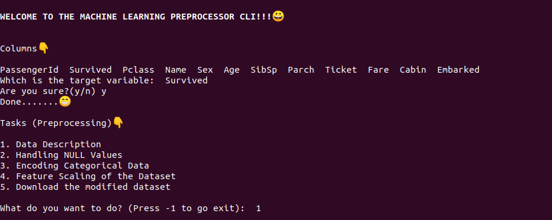

# :zap: ML Preprocessor CLI

The CLI made to preprocess the database and save your **time**:clock1:

## Gist

- Given the database, the CLI provides various options to preprocess the data. 
- Options:
    - Data Description
    - Handling NULL Values
    - Encoding Categorical Data
    - Feature Scaling
- We can also **DOWNLOAD**:arrow_down: the modified dataset.

## :memo: To-Do

- [x] Implement try-catch
- [x] Handling case in the input
- [x] Adding Emoji's
- [ ] Implementing graph functions for Analysis
- [x] Adding Comments

## Run

- Clone this Repository: `git clone https://github.com/utkryuk/ML-Preprocessor-CLI.git`
- `cd ML-Preprocessor-CLI/`
- `pip3 install -r requirements.txt`
- Now run, python3 `main.py` [Dataset's Path]
- Ex: `python3 main.py dataset.csv`
- Then you will see the below home screen.

## :camera: Screenshots

    

## Future Scope

- Implementing GUI of this project.
- Implement Undo and Redo for the Database.
- Implement other preprocessing steps.

#### If you have any questions, just let me know [here.](mailto:utkryuk@gmail.com)